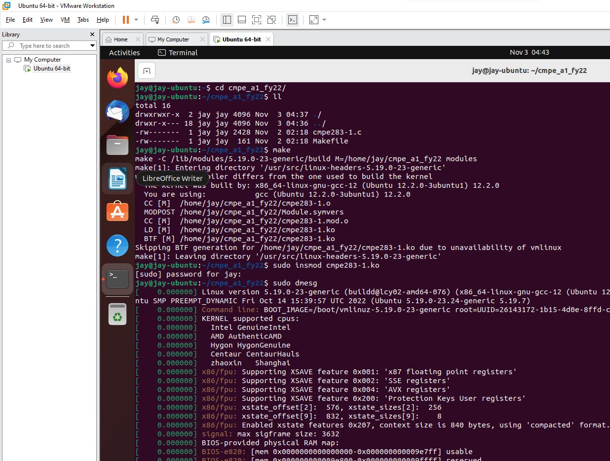
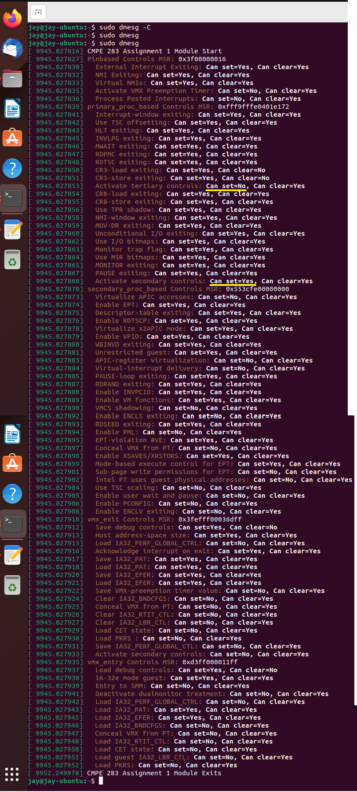

# FA22: CMPE-283 Sec 48 - Virtual Technologies Assignment-1

Here are the steps detailed to execute Assignment-1 on Ubuntu VM hosted on VMWare Workstation.

## Contributors

**`JAYA KRISHNA THUPILI`**

## System & Prerequisites

- System Type: x64-based PC
- Processor: 12th Gen Intel(R) Core (TM) i7-1260P (12 Cores)
- Installed Physical Memory (RAM): 16.0 GB
- Windows 11 Professional
- VMware® Workstation 16 Pro [Trial/Download](https://www.vmware.com/products/workstation-pro.html)
- Ubuntu 22 [Download](https://releases.ubuntu.com/22.10/ubuntu-22.10-live-server-amd64.iso?_ga=2.70008919.652567418.1667472597-1208328021.1667382980)
- Intel® 64 and IA-32 Architectures Software Developer Manuals (SDM) - [Download](https://www.intel.com/content/www/us/en/developer/articles/technical/intel-sdm.html)
  - For this assignment, SDM release version **_April 2022_** is referred.

## Enabling Nested Virtualization

To enable nested virtualization for VMs running on Windows 11

- Disable the default security features on Core Isolation.


- Turn-off the following windows features. Start > Type "**Turn Windows features on**"


## Installing Ubuntu

- Before creating Ubuntu VM using VMWare Workstation, enable the following options on VM > Settings > Processors


- Create a VM with 4 cores (2x2 cores), 8GB RAM and 200GB HDD and install Ubuntu.
- Once the VM is booted, verify that nested VMM capabilities are available.


## Initial setup and run

- Create a github repo, checkout and push the initial/draft setup files



- Verify dmesg logs


- Initial setup is complete. Commit and push the code to github.

## Things to know about MSR checks

- MSR checks would let VMM author know which VMM capabilities are exposed by CPU.
- Intel® 64 and IA-32 Architectures SDM (Release April 2022) [(download)](https://www.intel.com/content/www/us/en/developer/articles/technical/intel-sdm.html) > Volume 3 > Section "24.6.1 through 24.8.1" describes these controls and the capabilities that each Bit Position would represent.

  - 24.6.1 Pin-Based VM-Execution(**a.k.a** VME) Controls (**5**).
  - 24.6.2 (Primary) Processor-Based VME Controls (**22**).

    - Table 24-7 lists the **_secondary_** processor-based VME Controls (**28**).
    - Table 24-7 lists the **_tertiary_** processor-based VME Controls (**4**).

  > If Bit 31 of primary processor-based VME control is 0, that do not support the **_secondary_** processor-based VME controls

  > If Bit 17 of primary processor-based VME control is 0, that do not support the **_tertiary_** processor-based VME controls

  - Skip **report_capability**(refer ) for those(secondary/tertiary) MSRs when their Bit value is 0.
  - 24.7.1 VM-Exit Controls(**17**).
  - 24.8.1 VM-Entry Controls(**13**).

## Steps to add remaining MSR checks to the kernel module

- Refer the above listed sections and tables in Intel SDM and construct a 'struct' for remaining MSRs(5).
- Check for the Bit value at 31 & 17 for (Primary) Processor-Based VME Controls to skip secondary & tertiary MSRs.
- Build, load the kernel module and check the logs for custom messages

```bash
> make clean
> sudo dmesg -C
> make
> sudo insmod cmpe283-1.ko
> sudo rmmod cmpe283-1
> sudo dmesg
> make clean
```


### 1. Show ALL MSR Controls (not optimized)


### 2. From the above O/P, `primary_proc_based` MSR Controls shows the availability status of **_secondary_** and **_tertiary_** MSRs. Add suitable conditional blocks in function `detect_vmx_features()` to skip querying those unavailable MSRs

### 3. Final **_`dmesg`_** O/P listing MSR controls that are available

On this VMM, **_tertiary_** MSRs are unavailable.



## Unlicense

[](http://unlicense.org/)

## References

- [VMWare KB 76918: VMware workstation with hyper-v or device/credential guard enabled](https://kb.vmware.com/s/article/76918)
- [Disable Side Channel Mitigation in VMware Workstation (windowsloop.com)](https://windowsloop.com/disable-side-channel-mitigation-in-vmware/#:~:text=1%20First%2C%20open%20the%20VMware%20application.%20You%20can,re-open%20VMware%20Workstation%20to%20fully%20apply%20the%20changes.)
- [Ostechnix.com How-to-enable-nested-virtualization-in-kvm-in-linux](https://ostechnix.com/how-to-enable-nested-virtualization-in-kvm-in-linux/)
